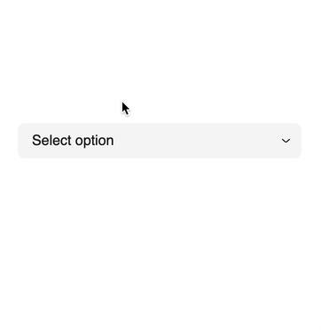

# vue-sticky-select



Select component for VueJS, inspired by macOS native select UI element.

🎥[Demo](https://liutkin.github.io/vue-sticky-select/)

## Install

```bash
npm i vue-sticky-select
```

```js
import StickySelect from "vue-sticky-select";

export default {
  name: "FooBar",
  components: {
    StickySelect,
  },
};
```

## Usage

### Select with prefix icons

```html
<sticky-select
  :options="options"
  v-model="selectedOptionIndex"
  placeholder="Select option"
/>
```

```js
import StickySelect from "vue-sticky-select";

export default {
  name: "FooBar",
  components: {
    StickySelect,
  },
  data: () => ({
    selectedOptionIndex: null,
    options: [
      {
        prefix: () => import("@/SomeIcon"),
        text: "Banana",
      },
      {
        prefix: () => import("@/SomeIcon"),
        text: "Avocado",
      },
      {
        prefix: () => import("@/SomeIcon"),
        text: "Durian",
      },
    ],
  }),
};
```

### Select with plain strings

```html
<sticky-select
  :options="options"
  v-model="selectedOptionIndex"
  placeholder="Select option"
/>
```

```js
import StickySelect from "vue-sticky-select";

export default {
  name: "FooBar",
  components: {
    StickySelect,
  },
  data: () => ({
    selectedOptionIndex: null,
    options: ["Banana", "Avocado", "Durian"],
  }),
};
```

## Props

| Prop          | Type      | Required | Default           | Description                                           |
| ------------- | --------- | -------- | ----------------- | ----------------------------------------------------- |
| `options`     | `Array`   | `true`   | `[]`              | List of options                                       |
| `selected`    | `Number`  | `false`  | `null`            | Selected option index number                          |
| `placeholder` | `String`  | `false`  | `""`              | Placeholder text when no `selected` index is provided |
| `disabled`    | `Boolean` | `false`  | `false`           | Disable select                                        |
| `base-class`  | `String`  | `false`  | `"sticky-select"` | Base CSS class                                        |

## Events

| Name     | Arguments | Description              |
| -------- | --------- | ------------------------ |
| `change` | `index`   | On newly selected option |
| `open`   | None      | On options opened        |
| `close`  | None      | On options closed        |
